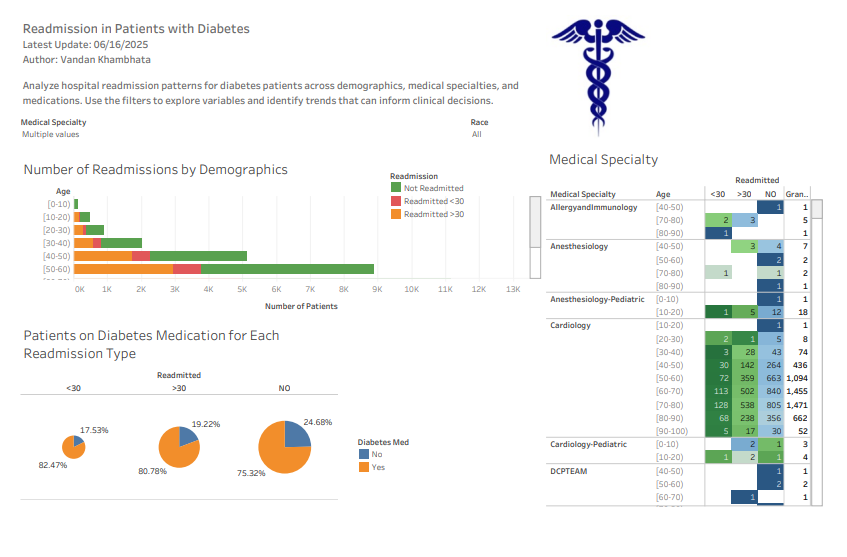

# Diabetes Readmission Dashboard

📊 **Project Title**: Readmission in Patients with Diabetes  
🔗 **Live Dashboard**: [View on Tableau Public](https://public.tableau.com/views/DiabetesHealthcareAnalyticsDashboardpracticeLab/ReadmissionandDiagnoses?:language=en-GB&:sid=&:redirect=auth&:display_count=n&:origin=viz_share_link)

## 📌 Overview
This interactive Tableau dashboard analyzes hospital readmission patterns for diabetic patients using the Diabetes 130-US Hospitals dataset. It was built as part of the Data Analytics Professional Certificate by DeepLearning.AI.

## 🧠 Key Insights
- Visualizes readmission trends across **demographics**, **medication types**, and **medical specialties**
- Includes **interactive filters** for race and medical specialty
- Designed to assist hospital administrators in identifying risk factors for 30-day readmissions

## 📈 Tools Used
- **Tableau Public**
- **Data Source**: [UCI Diabetes 130-US Hospitals dataset](https://archive.ics.uci.edu/ml/datasets/diabetes+130-us+hospitals+for+years+1999-2008)

## 💡 Features
- Dashboard built for web display (1366×768px resolution)
- Drag-and-drop interactivity with dynamic filtering
- Floating legends and container optimization for a clean layout

## 📷 Screenshots

## 👤 Author
**Vandan Khambhata**  
📧 vandan.khambhata@gmail.com  
🔗 [LinkedIn](https://www.linkedin.com/in/vandank)
